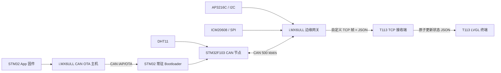
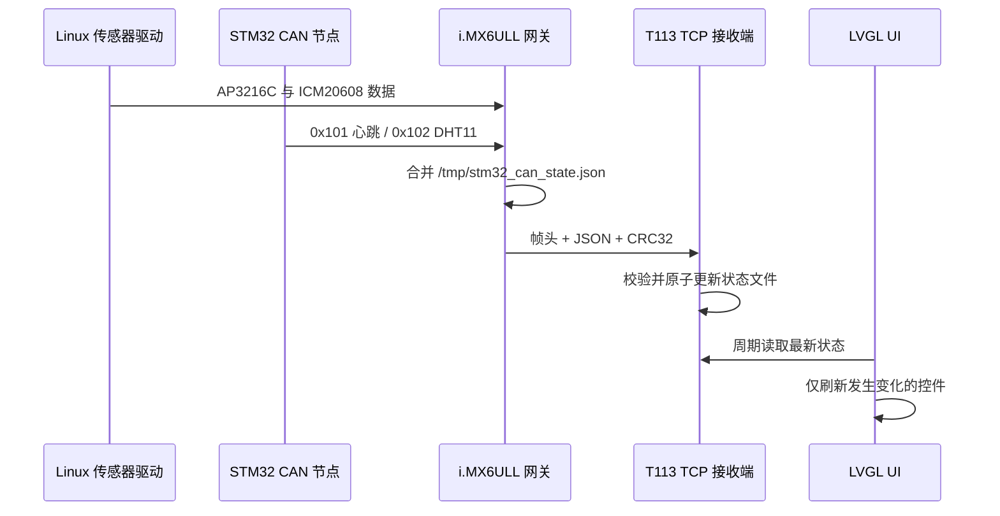

<div align="center">

# i.MX6ULL + T113 + STM32F103 分布式嵌入式物联网网关

**集 Linux 传感器采集、CAN 节点、TCP 可视化与 CAN IAP/OTA 于一体的分布式嵌入式原型系统**


</div>

---

## 项目简介

本项目实现了一套由 **i.MX6ULL、全志 T113 与 STM32F103** 组成的三节点分布式嵌入式物联网系统。

- **i.MX6ULL 边缘网关**：采集 AP3216C 与 ICM20608 数据，通过 SocketCAN 接收 STM32F103 的 DHT11 数据，并将多个节点的状态合并后发送给 T113。
- **STM32F103 CAN 节点**：周期上报心跳和温湿度数据，接收 LED 控制与 Bootloader 切换命令，并支持通过 CAN 总线进行固件升级。
- **全志 T113 显示终端**：接收带帧头和 CRC32 的 TCP 数据，写入原子状态文件，再由 LVGL 页面显示设备在线状态与传感器数据。

i.MX6ULL 同时作为 CAN OTA 主机，可向 STM32 常驻 Bootloader 发送新 App 固件。Bootloader 依次完成应用区擦除、分块写入、序号检查、CRC32 校验以及 App 跳转，构成 Linux 网关远程升级 CAN 节点固件的完整闭环。



## 核心亮点

| 模块 | 实现内容 | 工程要点 |
|---|---|---|
| Linux 传感器采集 | AP3216C 通过 I2C/sysfs 或字符设备读取，ICM20608 通过字符设备读取 | 打通内核驱动到用户态的数据链路，并隔离单个设备故障 |
| TCP 板间通信 | 20 字节二进制帧头 + JSON 负载 | 序号、时间戳、长度、CRC32、完整收发、心跳与断线重连 |
| STM32 CAN 节点 | 心跳、DHT11 数据、LED 控制和控制应答 | SocketCAN 过滤、Checksum8、超时离线判断 |
| CAN OTA | Linux 主机发送固件信息和 6 字节数据分片 | Flash 擦写、序号检查、进度状态、整包 CRC32 与 App 有效性校验 |
| T113 数据桥接 | TCP 接收端原子更新 `/tmp/t113_sensor_state.json` | 网络线程与 LVGL UI 解耦，避免网络阻塞影响界面刷新 |
| LVGL 交互终端 | 主页面、睡眠页面、模拟/数字时钟及横向传感器圆环 | 合并页面定时器，数据无变化时不重复刷新控件 |
| 后台运行 | 启停脚本、PID 文件、日志及有上限的重连退避 | 程序在后台持续运行，不占用板卡前台串口 |

## 数据链路



## 软件分层

| 层级 | 主要职责 |
|---|---|
| STM32 应用层 | DHT11 采集、CAN 心跳/数据上报、控制命令处理 |
| STM32 Bootloader | OTA 会话、Flash 擦写、CRC 校验和 App 跳转 |
| i.MX6ULL CAN 服务 | 接收 CAN 帧，维护 STM32 在线状态，输出 JSON/CSV |
| i.MX6ULL 网关服务 | 采集本地传感器、合并 CAN 节点状态、封装 TCP 帧 |
| T113 接收服务 | TCP 监听、完整帧解析、CRC 校验、状态文件写入 |
| T113 LVGL 应用 | 页面管理、状态轮询、控件差量刷新与交互 |

## 项目结构

```text
.
|-- docs/                         # 通信协议、OTA 与部署文档
|-- linux/
|   |-- imx6ull_gateway/          # i.MX6ULL 采集与 TCP Client
|   |-- can_sensor_client/        # SocketCAN 接收与状态发布
|   `-- can_ota_host/             # STM32 固件传输工具
|-- t113/
|   |-- tcp_receiver/             # TCP Server 与 JSON/CSV 输出
|   `-- lvgl_app/                 # 最新 LVGL UI 和数据桥接源码
|-- stm32/
|   |-- can_ota_bootloader/       # 常驻 CAN Bootloader
|   `-- dht11_can_app/            # DHT11 CAN App，链接到 0x08010000
|-- .env.example                  # 不含密钥的环境变量示例
|-- THIRD_PARTY_NOTICES.md        # 第三方来源与许可证边界
`-- LICENSE                       # 本项目自研代码的使用说明
```

## 硬件与软件环境

| 类别 | 组成 |
|---|---|
| Linux 网关 | NXP i.MX6ULL、Linux/Buildroot、SocketCAN |
| 显示终端 | 全志 T113、Tina Linux、LVGL |
| CAN 节点 | STM32F103、CAN 收发器、DHT11 |
| 网关传感器 | AP3216C（I2C）、ICM20608（SPI） |
| 开发工具 | GCC 交叉工具链、CMake、Keil MDK-ARM、can-utils |
| 网络通信 | TCP Socket；MQTT 作为后续扩展 |

CAN 物理层需要在两端配置 CAN 收发器，共地并连接 CANH/CANL，在总线两个物理端点各配置一个 120 欧终端电阻。

## 快速开始

### 1. 编译 Linux 应用

根据目标板工具链调整 `CC`：

```sh
make -C linux/can_sensor_client CC=arm-linux-gnueabihf-gcc
make -C linux/can_ota_host CC=arm-linux-gnueabihf-gcc
make -C linux/imx6ull_gateway CC=arm-linux-gnueabihf-gcc
make -C t113/tcp_receiver CC=arm-openwrt-linux-gcc
```

### 2. 启动 T113 TCP 接收端

```sh
cd t113/tcp_receiver
chmod +x start_t113.sh stop_t113.sh
./start_t113.sh
```

程序默认监听 `0.0.0.0:5000`，并输出：

```text
/tmp/t113_sensor_state.json
/tmp/t113_sensor_data.csv
/tmp/t113_tcp.log
```

### 3. 在 i.MX6ULL 启动 STM32 CAN 客户端

```sh
cd linux/can_sensor_client
chmod +x setup_can.sh start_client.sh stop_client.sh
./start_client.sh
cat /tmp/stm32_can_state.json
```

### 4. 启动 i.MX6ULL TCP 网关

```sh
cd linux/imx6ull_gateway
make CC=arm-linux-gnueabihf-gcc
T113_IP=192.168.3.32 PORT=5000 ./start_gateway.sh
tail -f /tmp/imx6ull_gateway.log
```

在 PC 或虚拟机中验证协议时，可给 `imx6ull_gateway_app` 增加 `-s` 参数生成模拟传感器数据。

### 5. 接入 T113 LVGL 应用

将 `t113/lvgl_app` 放入匹配的 T113 SDK 应用目录中编译。本仓库没有重复发布完整 SDK、平台库和来源不明确的媒体资源。

天气服务 Key 已从源码中移除，运行前按需设置：

```sh
export WEATHER_API_KEY=your_key_here
export T113_SENSOR_STATE_FILE=/tmp/t113_sensor_state.json
```

缺失资源的处理方式见 [LVGL 资源说明](t113/lvgl_app/res/README.md)。

### 6. 执行 STM32 CAN OTA

先通过 Keil 烧录常驻 Bootloader，将 STM32 App 链接到 `0x08010000` 并生成 `.bin`，然后在 i.MX6ULL 执行：

```sh
cd linux/can_ota_host
chmod +x setup_can.sh run_ota.sh
./run_ota.sh stm32_dht11_can_app.bin
```

一次成功升级依次经历 `ready`、`erasing`、`writing`、`verify` 和 `done`。固件二进制不进入 Git 历史，建议作为版本化的 GitHub Release 附件发布。

## 协议文档

- [TCP 帧格式与 JSON 数据](docs/TCP_PROTOCOL.md)
- [CAN 遥测与控制协议](docs/CAN_PROTOCOL.md)
- [CAN IAP/OTA 流程](docs/OTA_FLOW.md)
- [编译与板端部署](docs/BUILD_AND_DEPLOY.md)
- [GitHub 发布检查清单](docs/PUBLISH_CHECKLIST.md)

## 当前完成情况

| 功能 | 状态 |
|---|---|
| AP3216C、ICM20608 板端采集 | 已在 i.MX6ULL 验证 |
| i.MX6ULL 到 T113 自定义 TCP 通信 | 已验证 |
| TCP 心跳、CRC、断线重连与离线状态 | 已实现 |
| STM32 心跳与 DHT11 CAN 数据上报 | 已实现，真实数据依赖正常 DHT11 硬件 |
| Linux CAN 状态 JSON/CSV 输出 | 已验证 |
| STM32 CAN Bootloader 与整包 OTA | 已验证 |
| T113 LVGL 设备状态和传感器可视化 | 已集成 |
| MQTT 命令下发与状态回传 | 规划中，当前仓库未包含 |
| i.MX6ULL 本地 OTA 进度页面 | 规划中 |
| 固件签名、回滚和断点续传 | 规划中 |

## 验证方法

```sh
# 查看 CAN 总线原始帧
candump can0

# 查看 STM32 最新状态
cat /tmp/stm32_can_state.json

# 查看 i.MX6ULL 网关日志
tail -f /tmp/imx6ull_gateway.log

# 查看 T113 接收状态
cat /tmp/t113_sensor_state.json
tail -f /tmp/t113_tcp.log
```

预期链路状态：

```text
STM32 -> CAN -> /tmp/stm32_can_state.json
       -> i.MX6ULL TCP frame
       -> T113 /tmp/t113_sensor_state.json
       -> LVGL controls
```

## 演进方向

- 使用轻量级 JSON 解析器替代当前的字段查找逻辑。
- 增加 MQTT 控制路由、网关状态上报与主题权限设计。
- 为 OTA 主机增加状态 JSON，并在 i.MX6ULL 本地屏幕显示升级进度。
- 增加固件版本策略、数字签名、回滚确认和掉电恢复机制。
- 增加 CAN bus-off 自动恢复、节点注册和多节点地址分配。
- 为两个 Linux 应用增加系统服务、看门狗与开机启动管理。
- 增加针对错误 CRC、超长帧、粘包和拆包的自动化协议测试。

## 版权与第三方说明

本项目新增的集成代码 Copyright (c) 2026 [Maaap1e](https://github.com/Maaap1e)，保留所有权利。源码公开用于个人学习、技术评估与作品集展示；未经项目作者书面许可，不授予商业使用、再许可或重新分发权利。

本项目基于第三方 SDK、开源库和开发板例程进行集成。已有的第三方文件头与许可证声明会继续保留，不受本项目版权声明覆盖。具体来源与边界见 [THIRD_PARTY_NOTICES.md](THIRD_PARTY_NOTICES.md)。来源或再分发授权不明确的头像、字体、音乐及图片资源没有包含在公开目录中。

---

<div align="center">

**i.MX6ULL 边缘网关 / STM32 CAN 节点 / T113 LVGL 终端**

</div>
