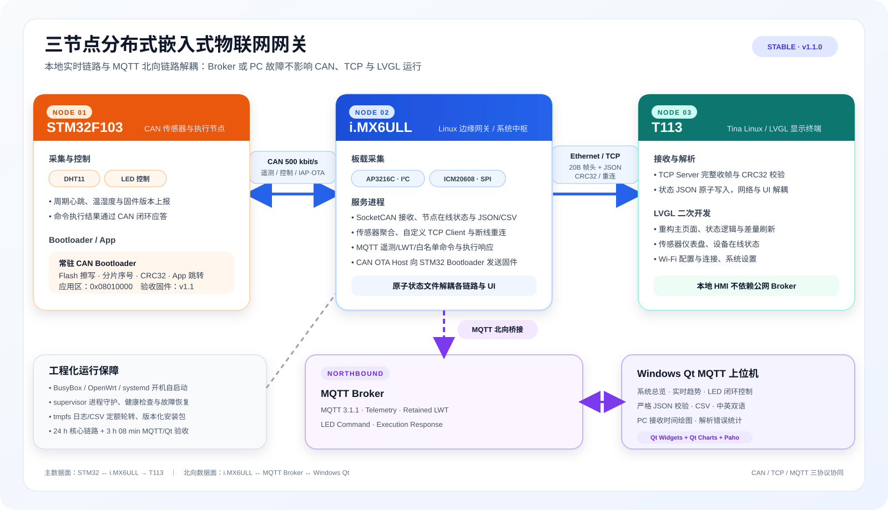
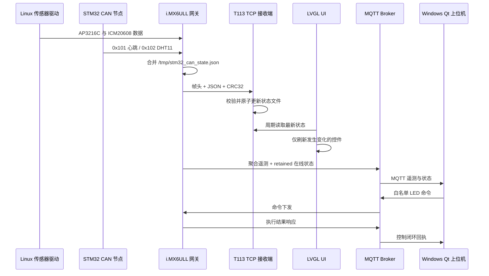

<div align="center">

# i.MX6ULL + T113 + STM32F103 分布式嵌入式物联网网关

**集 Linux 边缘采集、CAN 节点与 OTA、T113/LVGL 本地显示、MQTT 北向接入和 Qt 上位机于一体的分布式嵌入式系统**


</div>

---

## 项目简介

本项目实现了一套由 **i.MX6ULL、全志 T113 与 STM32F103** 组成的三节点分布式嵌入式物联网系统。

- **i.MX6ULL 边缘网关**：采集 AP3216C 与 ICM20608 数据，通过 SocketCAN 接收 STM32F103 的 DHT11 数据，聚合状态后分别发送至 T113 本地终端和 MQTT Broker。
- **STM32F103 CAN 节点**：周期上报心跳和温湿度数据，接收 LED 控制与 Bootloader 切换命令，并支持通过 CAN 总线进行固件升级。
- **全志 T113 显示终端**：接收带帧头和 CRC32 的 TCP 数据，写入原子状态文件，再由 LVGL 页面显示设备在线状态与传感器数据。
- **Windows Qt 上位机**：通过 MQTT 订阅聚合遥测与在线状态，提供系统总览、实时趋势、CSV 记录和带执行回执的 LED 控制。

i.MX6ULL 同时作为 CAN OTA 主机，可向 STM32 常驻 Bootloader 发送版本化 `.ota3` 固件包。`v2.1.0-rc.1` 新增 A/B 双槽自动回滚、SHA-256/ECDSA-P256 发布者签名、Hardware ID/Key ID/版本策略和 2KB 页级断点续传。最终 App `2.1.0.3` 已完成 A/B 切换、未确认镜像回滚、传输断电续传、签名与策略拒绝以及完整冷启动保持实板验收。

当前稳定版本为 **`v1.1.0`**。当前候选版本 **`v2.1.0-rc.1`** 聚焦 A/B Secure CAN OTA，并已通过本报告声明范围内的实板验收。详见 [v1.0.0 核心链路实板验收报告](docs/acceptance/v1.0.0/RESULT.md)、[v1.1.0 MQTT/Qt 增量验收报告](docs/acceptance/v1.1.0-rc.1/RESULT.md)、[v1.2.0-rc.1 单槽版本化 OTA 验收报告](docs/acceptance/v1.2.0-rc.1/RESULT.md)和 [v2.1.0-rc.1 A/B Secure CAN OTA 验收报告](docs/acceptance/v2.1.0-rc.1/RESULT.md)。

## 系统架构



- **本地实时链路**：STM32F103 经 CAN 向 i.MX6ULL 上报数据并接收控制；i.MX6ULL 经自定义 TCP 帧向 T113 推送聚合状态，T113 负责 CRC32 校验、状态文件更新和 LVGL 显示。
- **北向管理链路**：i.MX6ULL 的独立 MQTT Bridge 发布遥测与 LWT 状态，并接收白名单控制命令；Windows Qt 上位机通过 Broker 完成监控、趋势记录和命令闭环。
- **升级链路**：i.MX6ULL Secure OTA Host 校验签名 `.ota3` 包，通过 CAN 发送认证 Manifest、2KB 页面哈希表和目标槽镜像；STM32 Bootloader 在擦除非确认槽前验证 Hardware ID、Key ID 与 ECDSA-P256 签名，写入后重算 CRC32/SHA-256，并通过 A/B 试启动确认、自动回滚和页级断点续传处理异常。
- **故障隔离**：MQTT Broker 或 PC 离线不阻塞 CAN、TCP 与 LVGL 本地链路；关键进程由 supervisor 管理，日志和 CSV 在 tmpfs 中定额轮转。

## 贡献范围与可验证证据

本仓库是基于芯片厂商 SDK、开发板例程和既有 T113/LVGL 工程完成的系统集成项目，不把第三方基础代码或全部教学页面声明为原创。项目工作的重点是：

- 设计三节点系统架构、自定义 TCP 帧和 CAN 应用协议，完成 Linux 网关、T113 接收服务、STM32 CAN 节点及 CAN IAP/OTA 的跨平台联调。
- 基于 i.MX6ULL 官方/开发板例程适配 AP3216C（I2C）和 ICM20608（SPI）驱动与设备树，修改寄存器读写、字符设备接口并编写用户态验证程序；通过 NFS 挂载缩短模块和应用部署周期。
- 基于既有 T113/LVGL 工程完成二次开发，重构页面状态逻辑和主页面，接入网关数据、Wi-Fi 配置与连接、传感器仪表盘及设备在线状态，并优化定时器和差量刷新。
- 补充板端自启动、进程守护、健康检查、日志轮转、版本化打包和实板验收证据，使系统能够冷启动运行并从 CAN/TCP 断线及关键进程退出中恢复。

详细边界与源码证据索引见 [项目贡献与来源边界](docs/PROJECT_OWNERSHIP.md)；i.MX6ULL 驱动和 NFS 调试流程见 [驱动适配与 NFS 调试记录](docs/IMX6ULL_DRIVER_PORTING_AND_NFS.md)。

## 实物与界面展示

### 硬件联调实物

i.MX6ULL 负责传感器与 CAN 数据汇聚以及 STM32 CAN OTA，T113 负责 TCP 接收和 LVGL 人机界面显示；STM32F103 作为 CAN 传感器节点接入系统。


### LVGL 界面

LVGL 应用包含主页、番茄时钟、时间显示、快捷入口、Wi-Fi 设置、系统设置和传感器仪表盘。仪表盘实时显示光照、温度、湿度、接近值以及网关和 STM32 节点的在线状态。


> 界面中出现的第三方商标和应用图标归各自权利人所有，仅用于实机界面与功能展示。

## 核心亮点

| 模块 | 实现内容 | 工程要点 |
|---|---|---|
| Linux 传感器采集 | 基于官方/开发板例程适配 AP3216C（I2C）和 ICM20608（SPI）驱动与设备树 | 修改寄存器读写和字符设备接口，以 NFS + 用户态程序验证 `/dev` 数据链路 |
| TCP 板间通信 | 20 字节二进制帧头 + JSON 负载 | 序号、时间戳、长度、CRC32、完整收发、心跳与断线重连 |
| STM32 CAN 节点 | 心跳、DHT11 数据、LED 控制和控制应答 | SocketCAN 过滤、Checksum8、超时离线判断 |
| CAN OTA | Linux 主机发送签名 Manifest、认证页哈希表和 6 字节数据分片 | A/B 自动回滚、SHA-256/ECDSA-P256、误刷/误降级保护、Flash 回读及 2KB 页级断点续传 |
| T113 数据桥接 | TCP 接收端原子更新 `/tmp/t113_sensor_state.json` | 网络线程与 LVGL UI 解耦，避免网络阻塞影响界面刷新 |
| MQTT 北向桥接 | 独立进程发布聚合 JSON、LWT 状态并处理白名单命令 | Broker 故障不影响 CAN/TCP/LVGL，支持退避重连、守护和日志轮转 |
| Windows Qt 上位机 | 总览、趋势、控制、设置、CSV 与中英双语界面 | 严格 JSON 校验、PC 接收时间绘图、解析错误统计及命令执行回执 |
| LVGL 交互终端 | 基于既有工程重构主页面和状态逻辑，接入网关数据、Wi-Fi 配置、仪表盘与在线状态 | 状态文件解耦网络与 UI，合并定时器，数据无变化时不重复刷新控件 |
| 后台运行 | 启停脚本、PID 文件、日志及有上限的重连退避 | 程序在后台持续运行，不占用板卡前台串口 |

## 数据链路


```mermaid
sequenceDiagram
    participant S as Linux 传感器驱动
    participant C as STM32 CAN 节点
    participant G as i.MX6ULL 网关
    participant R as T113 TCP 接收端
    participant U as LVGL UI
    participant B as MQTT Broker
    participant P as Windows Qt 上位机

    S->>G: AP3216C 与 ICM20608 数据
    C->>G: 0x101 心跳 / 0x102 DHT11
    G->>G: 合并 /tmp/stm32_can_state.json
    G->>R: 帧头 + JSON + CRC32
    R->>R: 校验并原子更新状态文件
    U->>R: 周期读取最新状态
    U->>U: 仅刷新发生变化的控件
    G->>B: 聚合遥测 + retained 在线状态
    B->>P: MQTT 遥测与状态
    P->>B: 白名单 LED 命令
    B->>G: 命令下发
    G->>B: 执行结果响应
    B->>P: 控制闭环回执
```

## 软件分层

| 层级 | 主要职责 |
|---|---|
| STM32 应用层 | DHT11 采集、CAN 心跳/数据上报、控制命令处理 |
| STM32 Bootloader | OTA 会话、Flash 擦写、CRC 校验和 App 跳转 |
| i.MX6ULL CAN 服务 | 接收 CAN 帧，维护 STM32 在线状态，输出 JSON/CSV |
| i.MX6ULL 网关服务 | 采集本地传感器、合并 CAN 节点状态、封装 TCP 帧 |
| i.MX6ULL MQTT Bridge | 发布聚合遥测和 LWT，校验白名单命令并回传执行结果 |
| T113 接收服务 | TCP 监听、完整帧解析、CRC 校验、状态文件写入 |
| T113 LVGL 应用 | 页面管理、状态轮询、控件差量刷新与交互 |
| Windows Qt 上位机 | MQTT 连接、遥测解析、趋势显示、CSV 记录与远程控制 |

## 项目结构

```text
.
|-- docs/                         # 通信协议、OTA 与部署文档
|-- common/                       # 单槽与 A/B OTA 协议、CRC/SHA-256 公共实现
|-- config/                       # 两块 Linux 板的运行配置
|-- deploy/                       # BusyBox init 与 systemd 服务
|-- linux/
|   |-- imx6ull_gateway/          # i.MX6ULL 采集与 TCP Client
|   |-- can_sensor_client/        # SocketCAN 接收与状态发布
|   |-- can_ota_host/             # v1 单槽 OTA Host（历史兼容）
|   |-- can_ota_host_ab_secure/   # A/B 签名 OTA Host 与服务协调脚本
|   `-- mqtt_bridge/              # MQTT 遥测上报与白名单命令桥接
|-- pc/
|   `-- mqtt_dashboard/           # Windows Qt MQTT 上位机
|-- t113/
|   |-- tcp_receiver/             # TCP Server 与 JSON/CSV 输出
|   `-- lvgl_app/                 # 最新 LVGL UI 和数据桥接源码
|-- stm32/
|   |-- common/                   # v1 单槽 Metadata（历史兼容）
|   |-- common_ab_secure/         # A/B Metadata、Resume Journal 与可信公钥
|   |-- can_ota_bootloader/       # v1 单槽 CAN Bootloader
|   |-- can_ota_bootloader_ab_secure/ # A/B + ECDSA Secure Bootloader
|   |-- dht11_can_app_slot_a/     # Slot A App，链接到 0x08010000
|   `-- dht11_can_app_slot_b/     # Slot B App，链接到 0x08047000
|-- tools/                         # OTA3 签名打包、密钥生成与负向测试工具
|-- scripts/                      # 虚拟机构建/打包、板端安装/守护与健康检查
|-- tests/                        # TCP、MQTT、OTA 包单测与故障注入
|-- VERSION                       # 发布版本
|-- .env.example                  # 不含密钥的环境变量示例
|-- THIRD_PARTY_NOTICES.md        # 第三方来源与许可证边界
`-- LICENSE                       # 本项目自研代码的使用说明
```

## 硬件与软件环境

| 类别 | 组成 |
|---|---|
| Linux 网关 | NXP i.MX6ULL、Linux/Buildroot、SocketCAN |
| 显示终端 | 全志 T113、Tina Linux、LVGL |
| CAN 节点 | STM32F103、CAN 收发器、DHT11 |
| 网关传感器 | AP3216C（I2C）、ICM20608（SPI） |
| 开发工具 | GCC 交叉工具链、CMake、Keil MDK-ARM、can-utils |
| 网络通信 | 自定义 TCP 帧；Eclipse Paho MQTT C 北向桥接（可选） |

CAN 物理层需要在两端配置 CAN 收发器，共地并连接 CANH/CANL，在总线两个物理端点各配置一个 120 欧终端电阻。

## 推荐工作流：Ubuntu 虚拟机交叉编译

开发板只运行 ARM 程序，不负责保存源码和编译。推荐链路为：

```text
Windows 宿主机 / GitHub
        -> Ubuntu 虚拟机交叉编译
        -> 生成 imx6ull、t113 两个 tar.gz 安装包
        -> scp 到对应开发板
        -> 板端安装、配置并启动
```

建议把仓库放在 Ubuntu 自己的 Linux 文件系统（例如 `~/workspace`），而不是长期放在 VMware 共享目录中，避免共享目录造成权限位丢失和编译速度下降。即使脚本没有执行权限，也可以统一用 `sh scripts/xxx.sh` 调用。

### 1. 在虚拟机确认交叉工具链

下面路径只是示例，必须替换成你虚拟机中的真实路径：

```sh
cd ~/workspace/imx6ull-t113-distributed-iot-gateway

export IMX_CC=/opt/imx6ull-toolchain/bin/arm-linux-gnueabihf-gcc
export T113_CC=/opt/t113-toolchain/bin/arm-openwrt-linux-gcc

"$IMX_CC" --version
"$T113_CC" --version
```

如果 T113 SDK 需要先执行环境脚本，就先进入 Tina SDK 执行其 `build/envsetup.sh`，再用 `command -v <编译器名称>` 找到编译器。不要照抄示例路径或编译器前缀。

### 2. 分别交叉编译

```sh
# i.MX6ULL：网关、CAN 采集和 CAN OTA 主机
IMX_CC="$IMX_CC" sh scripts/build_all.sh imx6ull

# T113：TCP 接收程序
T113_CC="$T113_CC" sh scripts/build_all.sh t113

# 确认产物是 ARM ELF，而不是虚拟机的 x86-64 程序
file linux/imx6ull_gateway/imx6ull_gateway_app
file linux/can_sensor_client/stm32_can_sensor_client
# 旧版单槽 Host（兼容保留）
file linux/can_ota_host/stm32_can_ota_host
# v2.1 A/B Secure Host
file linux/can_ota_host_ab_secure/stm32_can_ota_ab_secure_host
file t113/tcp_receiver/t113_display_app
```

这里的脚本只编译本仓库可独立构建的 Linux 用户态程序，不会重新编译 i.MX6ULL 内核/设备树/驱动、STM32 Keil 工程或完整 T113 LVGL 程序。T113 LVGL 仍需放回匹配的 Tina SDK 应用目录编译；当前 T113 安装包包含的是独立 TCP 接收服务。

### 3. 在虚拟机生成板端安装包

```sh
sh scripts/package_target.sh imx6ull
sh scripts/package_target.sh t113
ls -lh dist/
```

输出为：

```text
dist/iot-gateway-1.0.0-imx6ull.tar.gz
dist/iot-gateway-1.0.0-t113.tar.gz
dist/*.tar.gz.sha256
```

如果同名包已经存在，脚本会拒绝覆盖。确认需要重新生成时使用 `FORCE=1 sh scripts/package_target.sh <目标>`。

### 4. 从虚拟机传到开发板

```sh
scp dist/iot-gateway-1.0.0-imx6ull.tar.gz root@<IMX6ULL_IP>:/tmp/
scp dist/iot-gateway-1.0.0-t113.tar.gz root@<T113_IP>:/tmp/
```

可以同时传输对应的 `.sha256` 文件，并在板端支持 `sha256sum` 时执行 `sha256sum -c <文件名>.sha256` 检查传输完整性。如果板子没有 SSH/SCP，可以用 U 盘、TFTP 或 FTP 传输同一个安装包，后续安装步骤不变。

### 5. 在 i.MX6ULL 安装

```sh
cd /tmp
tar -xzf iot-gateway-1.0.0-imx6ull.tar.gz
cd iot-gateway-1.0.0-imx6ull
sh scripts/install_target.sh imx6ull
vi /etc/iot-gateway/imx6ull.conf
```

至少检查 `T113_IP`、`TCP_PORT`、`CAN_IFACE`、`CAN_BITRATE` 和三个传感器设备路径。安装内容进入 SD 卡根文件系统的 `/opt/iot-gateway` 和 `/etc/iot-gateway`，重启后仍然存在；运行日志位于 tmpfs `/tmp`，重启后清空。

### 6. 在 T113 安装

```sh
cd /tmp
tar -xzf iot-gateway-1.0.0-t113.tar.gz
cd iot-gateway-1.0.0-t113
sh scripts/install_target.sh t113
vi /etc/iot-gateway/t113.conf
```

### 7. 启动并检查

安装器会根据板端现有目录安装 systemd unit 或 BusyBox init 脚本；对于只执行 `/etc/rc.local`、不扫描新增 `S90*` 文件的厂商固件，也会自动注册相应启动命令。

```sh
# 普通 BusyBox i.MX6ULL
/etc/init.d/S90iot-imx6ull start

# OpenWrt/Tina 风格 T113
/etc/init.d/iot-t113 start

# systemd 版 i.MX6ULL
systemctl daemon-reload
systemctl enable --now iot-can-sensor.service iot-imx6ull-gateway.service
systemctl enable --now iot-runtime-maintenance@imx6ull.service

# 健康检查
/opt/iot-gateway/scripts/healthcheck.sh imx6ull
/opt/iot-gateway/scripts/healthcheck.sh t113
```

两条健康检查命令分别在对应板子上执行，不是在虚拟机里执行。

## 手动调试流程

### 1. 单独编译 Linux 应用

根据目标板工具链调整 `CC`：

```sh
make -C linux/can_sensor_client CC=arm-linux-gnueabihf-gcc
# 旧版单槽 OTA Host（兼容保留）
make -C linux/can_ota_host CC=arm-linux-gnueabihf-gcc
# v2.1 签名、A/B、可续传 OTA Host
make -C linux/can_ota_host_ab_secure CC=arm-linux-gnueabihf-gcc
make -C linux/imx6ull_gateway CC=arm-linux-gnueabihf-gcc
make -C t113/tcp_receiver CC=arm-openwrt-linux-gcc
```

也可以按目标执行：

```sh
IMX_CC=arm-linux-gnueabihf-gcc sh scripts/build_all.sh imx6ull
T113_CC=arm-openwrt-linux-gcc sh scripts/build_all.sh t113
```

### 2. 启动 T113 TCP 接收端

```sh
cd t113/tcp_receiver
chmod +x start_t113.sh stop_t113.sh
./start_t113.sh
```

程序默认监听 `0.0.0.0:5000`，并输出：

```text
/tmp/t113_sensor_state.json
/tmp/t113_sensor_data.csv
/tmp/t113_tcp.log
```

### 3. 在 i.MX6ULL 启动 STM32 CAN 客户端

```sh
cd linux/can_sensor_client
chmod +x setup_can.sh start_client.sh stop_client.sh
./start_client.sh
cat /tmp/stm32_can_state.json
```

### 4. 启动 i.MX6ULL TCP 网关

```sh
cd linux/imx6ull_gateway
make CC=arm-linux-gnueabihf-gcc
T113_IP=192.168.3.32 PORT=5000 ./start_gateway.sh
tail -f /tmp/imx6ull_gateway.log
```

在 PC 或虚拟机中验证协议时，可给 `imx6ull_gateway_app` 增加 `-s` 参数生成模拟传感器数据。

### 5. 接入 T113 LVGL 应用

将 `t113/lvgl_app` 放入匹配的 T113 SDK 应用目录中编译。本仓库没有重复发布完整 SDK、平台库和来源不明确的媒体资源。

天气服务 Key 已从源码中移除，运行前按需设置：

```sh
export WEATHER_API_KEY=your_key_here
export T113_SENSOR_STATE_FILE=/tmp/t113_sensor_state.json
```

缺失资源的处理方式见 [LVGL 资源说明](t113/lvgl_app/res/README.md)。

### 6. 执行 STM32 CAN OTA

首次迁移先通过 SWD 烧录 `can_ota_bootloader_ab_secure`。Slot A 与 Slot B 必须分别链接到 `0x08010000` 和 `0x08047000`，不能把同一个链接镜像同时写入两个槽。正式私钥只保存在离线签名机，不进入仓库、i.MX6ULL 或 STM32。

使用两个已正确链接且 App 版本与 Manifest 一致的 `.bin` 生成签名 `.ota3`：

```sh
export OTA_KEY_PASSWORD='使用离线私钥的强口令'

python3 tools/package_stm32_ota_ab.py \
  --slot-a /path/to/slot-a.bin \
  --slot-b /path/to/slot-b.bin \
  --private-key /secure/offline/stm32-ota-p256-private.pem \
  --key-password-env OTA_KEY_PASSWORD \
  --version 2.1.0.3 \
  --output stm32-dht11-v2.1.0.3.ota3
```

把已签名 `.ota3` 复制到 i.MX6ULL，使用发布包持久化安装的 Secure Host 执行：

```sh
/opt/iot-gateway/linux/can_ota_host_ab_secure/run_ota.sh \
  /tmp/stm32-dht11-v2.1.0.3.ota3
```

一次成功升级依次经历签名 Manifest 校验、目标槽选择、认证页面哈希表传输、`erasing`、`writing`、Flash CRC32/SHA-256 复核、候选元数据持久化和 `done`。Bootloader 只允许候选槽试启动一次；App 完成核心 CAN 初始化后确认，Host 仅在收到版本和槽位完全匹配的确认心跳后报告成功。传输断电后重新发送同一个包，会复核已完成页面并从首个缺失或损坏的 2KB 页继续。

经过实板验收的 Bootloader、A/B App、正常签名 `.ota3`、i.MX6ULL 运行包和证据归档均随 `v2.1.0-rc.1` GitHub Pre-release 发布；私钥和故障注入包不公开。

### 7. 直接从完整仓库安装

如果为了调试把完整仓库复制到了目标板，也可以 root 身份直接执行：

```sh
sh scripts/install_target.sh imx6ull   # 在 i.MX6ULL
sh scripts/install_target.sh t113      # 在 T113
```

配置位于 `/etc/iot-gateway/`。BusyBox/Tina 系统使用 `/etc/init.d/S90iot-*`，systemd 系统使用 `deploy/systemd/` 中的服务；完整操作见运行管理文档。

## 文档导航

- [项目贡献与来源边界](docs/PROJECT_OWNERSHIP.md)
- [i.MX6ULL 驱动适配与 NFS 调试](docs/IMX6ULL_DRIVER_PORTING_AND_NFS.md)
- [TCP 帧格式与 JSON 数据](docs/TCP_PROTOCOL.md)
- [MQTT 北向桥接](docs/MQTT_BRIDGE.md)
- [Windows Qt MQTT 上位机](pc/mqtt_dashboard/README.md)
- [CAN 遥测与控制协议](docs/CAN_PROTOCOL.md)
- [v1 单槽 CAN IAP/OTA 流程](docs/OTA_FLOW.md)
- [A/B + SHA-256/ECDSA + 断点续传 OTA](docs/OTA_AB_SECURE_V3.md)
- [v2.1.0-rc.1 发布说明](docs/RELEASE_V2.1.0_RC1.md)
- [编译与板端部署](docs/BUILD_AND_DEPLOY.md)
- [运行、守护与日志限额](docs/RUNTIME_MANAGEMENT.md)
- [v1.0 实板验收清单](docs/V1_ACCEPTANCE.md)
- [v1.2.0-rc.1 STM32 CAN OTA 增量验收](docs/acceptance/v1.2.0-rc.1/RESULT.md)
- [v2.1.0-rc.1 A/B Secure CAN OTA 实板验收](docs/acceptance/v2.1.0-rc.1/RESULT.md)
- [GitHub 发布检查清单](docs/PUBLISH_CHECKLIST.md)

## 当前完成情况

| 功能 | 状态 |
|---|---|
| AP3216C、ICM20608 板端采集 | 已在 i.MX6ULL 验证 |
| i.MX6ULL 到 T113 自定义 TCP 通信 | 已验证 |
| TCP 心跳、CRC、断线重连与离线状态 | 已实现 |
| STM32 心跳与 DHT11 CAN 数据上报 | 已实现，真实数据依赖正常 DHT11 硬件 |
| Linux CAN 状态 JSON/CSV 输出 | 已验证 |
| STM32 CAN Bootloader 与基础整包 OTA | v1 单槽实现保留用于历史兼容 |
| A/B Secure CAN OTA | `v2.1.0-rc.1` 已通过 A/B 双向升级、试启动确认、自动回滚和最终冷启动保持 |
| SHA-256/ECDSA-P256 固件认证 | 已完成签名、Key ID、Hardware ID 和写入后 Flash 完整性实板验收 |
| 版本与降级策略 | 已完成默认降级拒绝、签名保护的授权降级及恢复最新版实板验收 |
| 2KB 页级断点续传 | 已完成约 30% 传输断电，并从 `12288/39716` 字节恢复至最终确认 |
| T113 LVGL 设备状态和传感器可视化 | 已集成 |
| 统一配置、优雅退出与健康检查 | `v1.0.0` 已实现 |
| BusyBox/systemd 开机启动与异常拉起 | `v1.0.0` 已实现，已完成实板冷启动验收|
| tmpfs 日志/CSV 定额轮转 | `v1.0.0` 已实现，已完成 24 小时实板验收 |
| CRC、超长帧、粘包与拆包测试 | 已加入自动化测试与故障注入工具 |
| OTA 与进程守护协调 | Secure Host 已纳入发布包，支持锁文件、采集服务暂停/恢复和 `/opt/iot-gateway` 持久化安装 |
| MQTT 命令下发与状态回传 | `v1.1.0` 已实现并完成 3 小时 8 分钟实板验收 |
| Windows Qt MQTT 上位机 | 已实现总览、趋势、控制、设置、CSV 与中英双语界面 |
| i.MX6ULL 本地 OTA 进度页面 | 规划中 |
| 远程安全 OTA | MQTT/TLS、命令权限、请求去重和固件安全下载仍在规划中 |

## 验证方法

```sh
# 查看 CAN 总线原始帧
candump can0

# 查看 STM32 最新状态
cat /tmp/stm32_can_state.json

# 查看 i.MX6ULL 网关日志
tail -f /tmp/imx6ull_gateway.log

# 查看 T113 接收状态
cat /tmp/t113_sensor_state.json
tail -f /tmp/t113_tcp.log
```

预期链路状态：

```text
STM32 -> CAN -> /tmp/stm32_can_state.json
       -> i.MX6ULL 聚合状态
          |-> TCP frame -> T113 state JSON -> LVGL controls
          `-> MQTT Broker -> Windows Qt dashboard / CSV / LED command
```

## 演进方向

- 使用轻量级 JSON 解析器替代当前的字段查找逻辑。
- 为 MQTT 增加 TLS、身份认证、请求去重及本地 Broker 验收。
- 为 OTA 主机增加状态 JSON，并在 i.MX6ULL 本地屏幕显示升级进度。
- 在现有签名 A/B OTA 上补充 RDP/WRP 量产保护、启动期完整认证和受保护单调版本计数器，形成更完整的安全启动与密码学防回滚链路。
- 完成 Metadata 页面轮转断电、Resume Journal 页面轮转断电和已完成 Flash 页人工篡改恢复等扩展故障注入。
- 增加 CAN bus-off 自动恢复、节点注册和多节点地址分配。
- 将运行指标接入轻量级监控，并保存正式版本的长期稳定性趋势。

## 版权与第三方说明

本项目新增的集成代码 Copyright (c) 2026 [Maaap1e](https://github.com/Maaap1e)，保留所有权利。源码公开用于个人学习、技术评估与作品集展示；未经项目作者书面许可，不授予商业使用、再许可或重新分发权利。

本项目基于第三方 SDK、开源库和开发板例程进行集成。已有的第三方文件头与许可证声明会继续保留，不受本项目版权声明覆盖。具体来源与边界见 [THIRD_PARTY_NOTICES.md](THIRD_PARTY_NOTICES.md)。来源或再分发授权不明确的头像、字体、音乐及图片资源没有包含在公开目录中。

---

<div align="center">

**i.MX6ULL 边缘网关 / STM32 CAN 节点 / T113 LVGL 终端**

</div>
