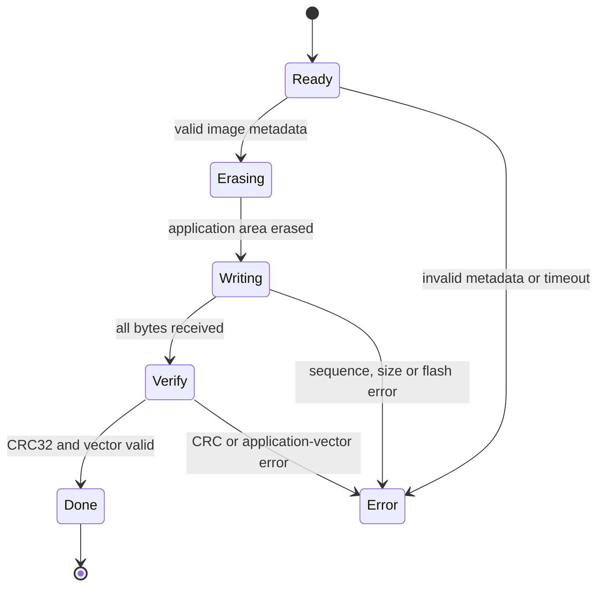

# STM32 CAN IAP/OTA

## Memory layout

The bootloader occupies the beginning of internal Flash. The application is
linked at `0x08010000`, so its vector table starts at a 64 KiB offset. The
bootloader validates the application stack pointer before setting MSP and
jumping to the reset handler.

```text
0x08000000  +-----------------------------+
            | Resident CAN bootloader     |
0x08010000  +-----------------------------+
            | Upgradable application      |
            | Maximum configured: 448 KiB |
            +-----------------------------+
```

## CAN identifiers

| CAN ID | Direction | Payload |
|---:|---|---|
| `0x300` | Host -> bootloader | Enter command, byte 0 = `0xA5` |
| `0x301` | Host -> bootloader | Little-endian image size and CRC32 |
| `0x302` | Host -> bootloader | Little-endian sequence plus 6 image bytes |
| `0x380` | Bootloader -> host | State, error, progress and sequence |

## State flow



Status values are `0x01` ready, `0x02` erasing, `0x03` writing, `0x04` verify,
`0x05` done and `0xE0` error. Error codes distinguish timeout, metadata, size,
sequence, Flash, CRC and invalid-application failures.

## Flash buffering

Each `0x302` frame carries only six firmware bytes because two bytes are used by
the sequence number. The bootloader accumulates data in a 2048-byte RAM buffer,
then programs that block to Flash. The final partial block is also flushed
before verification.

## Integrity and current boundary

CRC32 detects accidental transmission or storage corruption. It is not a
cryptographic signature and cannot prove who produced the firmware. Production
hardening should add signed manifests, anti-rollback policy, a confirmed boot
scheme and recovery from power loss during update.
