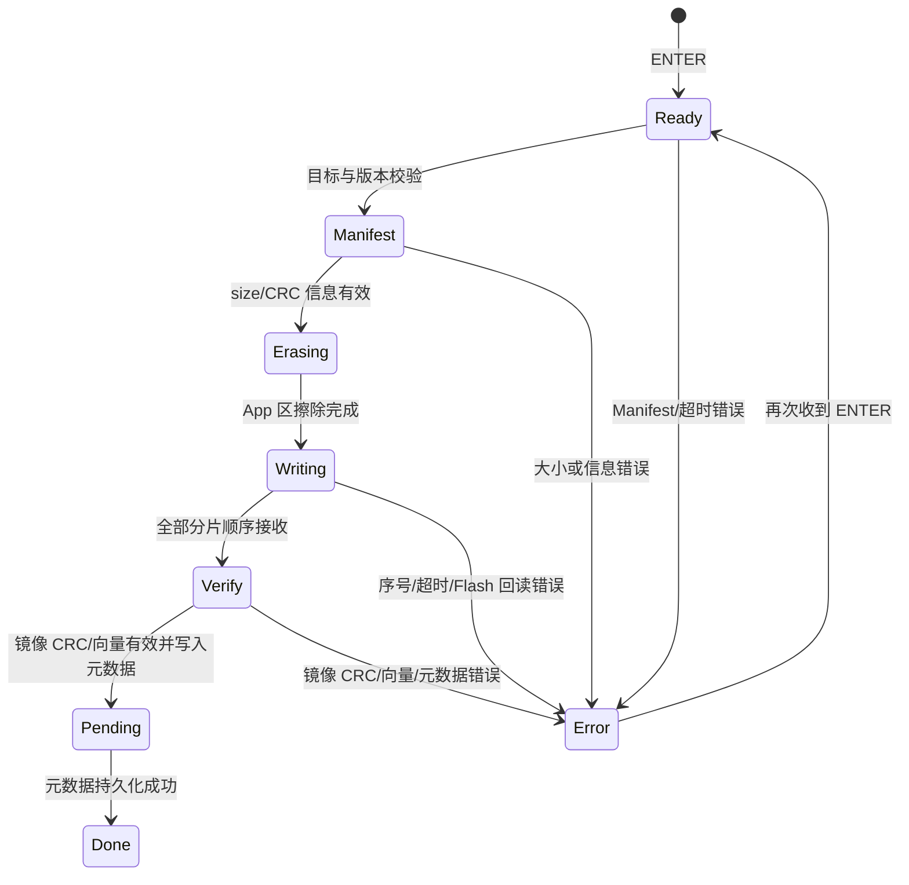

# STM32 CAN IAP/OTA：版本化升级与试启动确认

本链路由 i.MX6ULL OTA Host、CAN 总线和 STM32F103 常驻
Bootloader 组成。`v1.2.0-rc.1` 已在原有“分片传输 + CRC32”基础上增加：

- 固件包头 CRC32 与镜像 CRC32 双重完整性检查；
- 目标硬件 ID、四段式固件版本和显式降级标志；
- Bootloader 端版本比较和误刷保护；
- Flash 持久化启动元数据；
- `PENDING -> TRIAL -> CONFIRMED` 试启动确认；
- 升级中断、镜像损坏或试启动未确认时进入 CAN 恢复模式；
- Linux 端 `.ota` 固件包解析、长度/CRC/目标检查和明确错误输出。

> 该方案是 **单 App 分区的安全恢复方案**，不是 A/B 双分区回滚。
> STM32F103ZET6 内部 Flash 只有 512 KiB，当前保留一个 App 槽位。
> 坏镜像不会被反复启动，但旧镜像已被覆盖后不能自动恢复；需要在
> Bootloader 恢复模式下重新发送有效固件。

## 1. Flash 布局

```text
0x08000000  +----------------------------------+
            | 常驻 CAN Bootloader，64 KiB      |
0x08010000  +----------------------------------+
            | App 槽位，最大 0x6F800 字节      |
            | 即 446 KiB                       |
0x0807F800  +----------------------------------+
            | OTA 启动元数据，2 KiB / 1 页     |
0x08080000  +----------------------------------+
```

Keil 工程已经限制：

- Bootloader IROM：`0x08000000 + 0x10000`；
- App IROM：`0x08010000 + 0x6F800`；
- App 向量表偏移：`0x10000`。

这些边界的作用不仅是生成正确地址，也防止链接产物越界覆盖 App 或
元数据页。

## 2. `.ota` 固件包

Linux Host 不再接受裸 `.bin`。固件必须先由
`tools/package_stm32_ota.py` 生成 `.ota` 包：

```sh
python3 tools/package_stm32_ota.py \
  --input stm32/dht11_can_app/Output/stm32_dht11_can_app.bin \
  --output stm32_dht11_can_app-v1.2.0.3.ota \
  --version 1.2.0.3
```

需要执行受控降级时，由操作者显式加入：

```sh
python3 tools/package_stm32_ota.py \
  --input stm32_dht11_can_app.bin \
  --output stm32_dht11_can_app-v1.1.0-downgrade.ota \
  --version 1.1.0 \
  --allow-downgrade
```

打包器会拒绝空镜像、超过 App 槽位的镜像、错误的初始栈地址和不在
App 区域内的复位向量。包头为 32 字节，小端编码：

| 偏移 | 长度 | 字段 |
|---:|---:|---|
| 0 | 4 | Magic：`COTA` |
| 4 | 2 | Header size：32 |
| 6 | 1 | Package format：1 |
| 7 | 1 | Flags；bit0 为显式允许降级 |
| 8 | 2 | Hardware ID；STM32F103 为 `0xF103` |
| 10 | 2 | Reserved，必须为 0 |
| 12 | 4 | `major.minor.patch.build` 编码版本 |
| 16 | 4 | App 镜像长度 |
| 20 | 4 | App 镜像 CRC32 |
| 24 | 4 | Reserved，必须为 0 |
| 28 | 4 | 前 28 字节包头 CRC32 |

版本按无符号 32 位整数比较，每段占 8 bit，因此 `1.2.0.0` 大于
`1.1.255.255`。

## 3. CAN 协议

| CAN ID | 方向 | Payload |
|---:|---|---|
| `0x201` | Host -> App | byte0=`0xA5`，请求运行中的 App 复位进入 Bootloader |
| `0x300` | Host -> Bootloader | 进入 OTA，byte0=`0xA5` |
| `0x303` | Host -> Bootloader | 协议版本、flags、硬件 ID、固件版本 |
| `0x301` | Host -> Bootloader | 镜像长度和镜像 CRC32 |
| `0x302` | Host -> Bootloader | 16-bit 序号 + 6 字节镜像数据 |
| `0x380` | Bootloader -> Host | 状态、错误、进度、序号、已接收 KiB |

Host 会先发送一次 `0x201/A5`。若 App 正在运行，它会完成应答并复位；
若设备已经在 Bootloader 恢复模式，该帧会被忽略。随后 Host 重复发送
`0x300/A5`，覆盖 App 复位和 Bootloader 初始化 CAN 的时间窗口，因此
正常升级不依赖人工按复位键。

`0x303` Manifest 帧布局：

```text
DATA[0]    = protocol version
DATA[1]    = flags
DATA[2..3] = hardware ID, little endian
DATA[4..7] = firmware version, little endian
```

Bootloader 在擦除 App 之前完成 Manifest 校验。硬件 ID 不匹配、版本
为 0、未知 flags 或未授权降级都会被拒绝，因此错误固件不会先破坏
当前 App。

## 4. OTA 会话状态


```mermaid
stateDiagram-v2
    [*] --> Ready: ENTER
    Ready --> Manifest: 目标与版本校验
    Manifest --> Erasing: size/CRC 信息有效
    Erasing --> Writing: App 区擦除完成
    Writing --> Verify: 全部分片顺序接收
    Verify --> Pending: 镜像 CRC/向量有效并写入元数据
    Pending --> Done: 元数据持久化成功
    Ready --> Error: Manifest/超时错误
    Manifest --> Error: 大小或信息错误
    Writing --> Error: 序号/超时/Flash 回读错误
    Verify --> Error: 镜像 CRC/向量/元数据错误
    Error --> Ready: 再次收到 ENTER
```

状态码为：

- `0x01 READY`
- `0x02 ERASING`
- `0x03 WRITING`
- `0x04 VERIFY`
- `0x05 DONE`
- `0xE0 ERROR`

错误码 `0x01..0x0B` 分别覆盖超时、固件信息、大小、序号、Flash、
镜像 CRC、App 向量、Manifest、硬件 ID、版本策略和启动元数据。

## 5. 启动元数据和确认

元数据保存硬件 ID、版本、镜像长度、镜像 CRC32、自身 CRC32 和启动
状态。STM32F1 不允许把已经编程过的非零半字再次写入，因此状态转换
不能反复改写同一个 `state` 半字。实现中在元数据结构后保留两个独立
的擦除态半字：Bootloader 首次启动时只写 `trial marker`，App 完成核心
初始化后只写 `confirmed marker`。每个地址只编程一次，状态由元数据
初始值和两个 marker 共同推导，转换过程不需要重新擦除整个元数据页：

```text
PENDING (0xFFFE，元数据初始状态)
    |
    | Bootloader 校验镜像并准备首次启动
    v
TRIAL (0xFFFC，由独立 trial marker 推导)
    |
    | App 完成时钟、串口、显示和 CAN 初始化
    v
CONFIRMED (0xFFF8，由独立 confirmed marker 推导)
```

启动规则：

1. 元数据为空或损坏：不启动 App，进入恢复模式；
2. `PENDING`：校验镜像 CRC/向量，写成 `TRIAL` 后只试启动一次；
3. `TRIAL`：说明上次启动在确认前复位，不再启动，进入恢复模式；
4. `CONFIRMED`：每次启动前校验镜像 CRC/向量，通过后启动。

App 只在 Manifest 版本与编译时版本完全一致时确认。DHT11 属于可选
外设，确认点放在核心 CAN 路径初始化之后、DHT11 重试之前，避免外设
缺失把健康固件误判为启动失败。

为了验证“确认前复位”路径，App 提供默认关闭的
`OTA_CONFIRM_DELAY_MS` 编译期测试钩子。验收构建可临时将它设为
`10000u`，在 10 秒窗口内复位；正式发布构建必须保持为 `0u`。

## 6. 掉电行为

| 掉电位置 | 下次启动行为 |
|---|---|
| 擦除或数据传输期间 | 原元数据与镜像不再匹配，进入恢复模式 |
| 镜像校验失败 | 不写 `PENDING`，进入恢复模式 |
| 元数据擦写期间 | 元数据为空或 CRC 错误，进入恢复模式 |
| `PENDING` 写入后、试启动前 | 校验后进入一次 `TRIAL` 启动 |
| `TRIAL` 启动确认前 | 保持 `TRIAL`，进入恢复模式 |
| App 确认后 | `CONFIRMED`，正常校验并启动 |

所以“断电不变砖”的准确含义是：常驻 Bootloader 仍可通过 CAN 接收
新固件；它不等于自动恢复旧版本。

## 7. 板端执行

先用 ST-Link 烧录新版常驻 Bootloader。新版 Bootloader 不再无条件
启动没有元数据的旧 App，因此首次迁移后必须执行一次新版 `.ota`
升级：

```sh
/opt/iot-gateway/linux/can_ota_host/run_ota.sh \
  /tmp/stm32_dht11_can_app-v1.2.0.3.ota
```

成功日志应包含 Manifest 目标/版本、`erasing`、`writing`、`verify`
和 `done`。Linux Host 还会等待 App 完成确认后发出的匹配版本心跳；
只有收到该心跳，命令才以成功退出。

## 8. 实板验收与后续故障注入

### 8.1 `v1.2.0-rc.1` 已完成范围

最终 App `1.2.0.3` 已在 STM32F103 + i.MX6ULL 实板链路完成以下验证：

| 验收项 | 结果 |
|---|---|
| `.ota` Manifest、镜像长度和双 CRC 解析 | PASS |
| CAN 分片写入、STM32 端 `verify` 与 `done` | PASS |
| Host 等待并收到匹配版本 `1.2.0.3` 确认心跳 | PASS |
| 完整断电后仍启动已确认的 `1.2.0.3` | PASS |
| 冷启动后 DHT11 有效样本与 CAN 遥测恢复 | PASS |
| Linux supervisor、CAN client、gateway、MQTT bridge 健康 | PASS |

完整结论、固件哈希和原始终端记录见
[`docs/acceptance/v1.2.0-rc.1/RESULT.md`](acceptance/v1.2.0-rc.1/RESULT.md)。

### 8.2 后续对抗性故障注入矩阵

以下项目已有部分代码路径或自动化测试覆盖，但尚未纳入本次实板 PASS：

1. 把包内硬件 ID 改错，确认 Bootloader 在擦除前拒绝；
2. 发送低版本包，确认默认拒绝、带 `--allow-downgrade` 时允许；
3. 篡改包头或镜像，确认 Linux Host 在发送前拒绝；
4. 传输到约 30% 时断电，确认重启进入恢复模式并可重新刷入有效包；
5. 在 App 确认前人为复位，确认 Bootloader 不重复启动试运行镜像；
6. OTA 失败后不重启 Bootloader，直接发起第二次升级并恢复。

第 5 项可使用 `OTA_CONFIRM_DELAY_MS=10000u` 的专用验收构建稳定复现。
完成测试后应恢复为 `0u` 并重新生成正式 App 和 `.ota` 包，避免把故障
注入配置带入发布固件。

新增证据应保存到 `docs/acceptance/<version>/raw/`，并在 `RESULT.md`
中严格区分“自动化测试通过”和“实板故障注入通过”。

## 9. 安全边界与下一步

- CRC32 能发现随机损坏，不能证明固件发布者身份；
- 当前降级控制是操作策略，不是密码学防回滚；攻击者若能修改固件并
  重算 CRC，仍可伪造 Manifest；
- 单槽位只能进入恢复模式，不能自动恢复旧固件；
- 完整生产方案应增加公钥签名验证、受保护的单调版本计数，以及
  A/B 分区或外部 Flash 备份槽位；
- 断点续传尚未实现，传输中断后需要重新发送整个 `.ota` 包。

因此当前阶段可以准确描述为：
**“版本化 CAN OTA、误刷/误降级保护、试启动确认和掉电恢复模式”**，
不能描述为“安全启动”或“自动回滚”。
